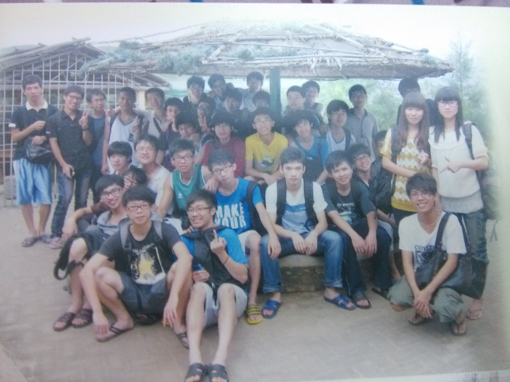

# 大学那些事（一）

拖着疲倦的身躯终于回到的我的出租房。从学校把毕业纪念册带回来了，上面的一张张照片和一句句留言都触碰着我的心弦。是啊，我们还有两个多月就真正走出校门了。大学里面的乌龙事，神展开，和激动人心的时刻，都历历在目。曾经憧憬着毕业离校，投入社会的我，现在却对学校的生活难以割舍。可能在大学里每个人都曾颓废过，迷失过，但是无法反驳的是，大学生活真的很美好。

大一刚入学的时候，怀揣着对大学的憧憬，来到这我的母校，五邑大学。正所谓无知无畏，初生牛犊的我感觉自己干劲满满，什么班委啊，社团啊，都去面试，表现得特别自信。直到和他——的相遇，[亮爷][1]才让我知道，什么才是低调的牛人。

一节课上， Tiger(班里的大帅比) 在和亮爷讨论代码，我刚好坐在他们的后面，也就一起参与讨论，然后在不知不觉中，就进入了亮爷的节奏。亮爷总会在消失几天以后邀请你到他的宿舍看看他的新作品。亮爷在技术方面非常出众，秒杀我们班所有人，总能向我们推销新潮的前沿技术。在我们懵懂学步，只会写一点点C言语的时候就沾沾自喜的时候，亮爷已经能产出很完整的作品了。像当年用 VB 写的记账本，用 Flash 写的机器人大战，用 PHP 写的抓头像脚本，都让我印象非常深刻。简直太牛逼了！

有一天，亮爷向我介绍 PHP 这门语言，并且计划在下一年一起做个作品参加软件设计大赛（校内学术活动，以下简称：软设）。有亮爷这样靠谱的队友真真是极好的，这个大腿抱定了！

基本上，大一就在什么都不曾通晓的状态下顺利过渡到大二。经过了暑假的学习，总算会写点 PHP。那时候用的是 Dreamweaver ，现在想想真的是土爆了。XD

啊对了！经常与我们一起交流的还有一个人，那就是洪爷。关于洪爷，我们还是另开篇幅去详细谈谈吧。

大二一开学，学院就公开了软设题目：“移动与生活”。为了切题，我们最终计划做一个校园生活的移动端网站，选了 jqueryMobile + smarty 这样的组合捣鼓出了[“校园地带”][2]。对了，我们成立了  [phrief][3] 小组，当时还请了小静（PS高手）给我们做了个很酷炫的 logo。

透过内部消息（我是学生会干部），我获得其他队伍的参赛信息，得知原来我们的作品是最碉堡的（至少当时我是这么认为），感觉拿冠军志在必得啊。但始料未及，校园地带居然未能如愿获得冠军！欲知后事如何，且听下回分解。

  [1]: https://github.com/fritx
  [2]: https://github.com/phrief/xydd
  [3]: https://github.com/phrief