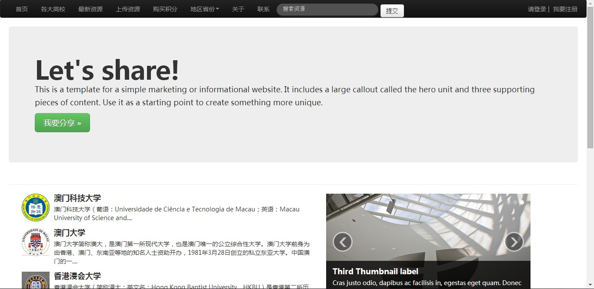
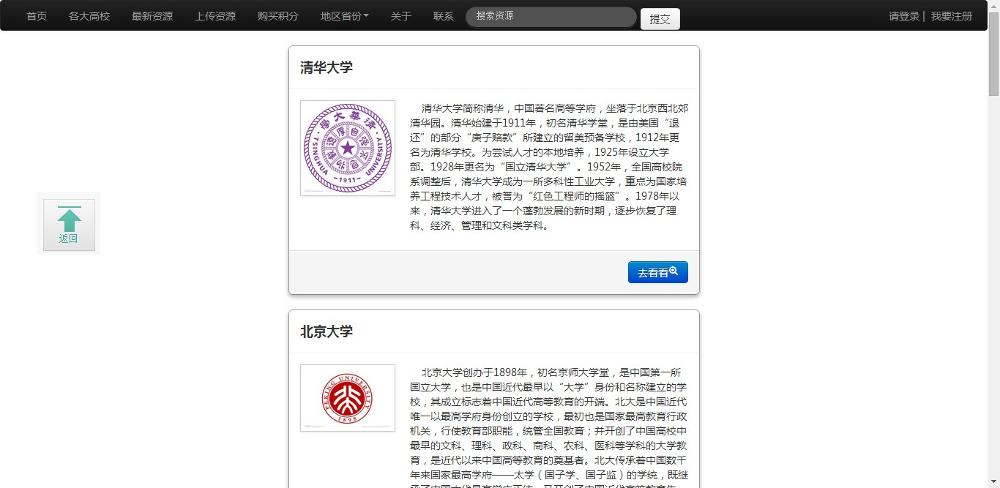
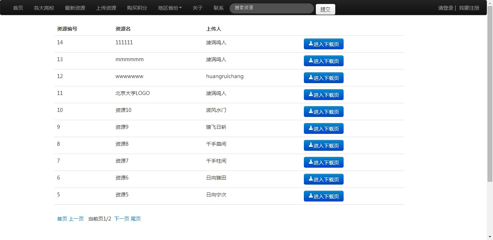
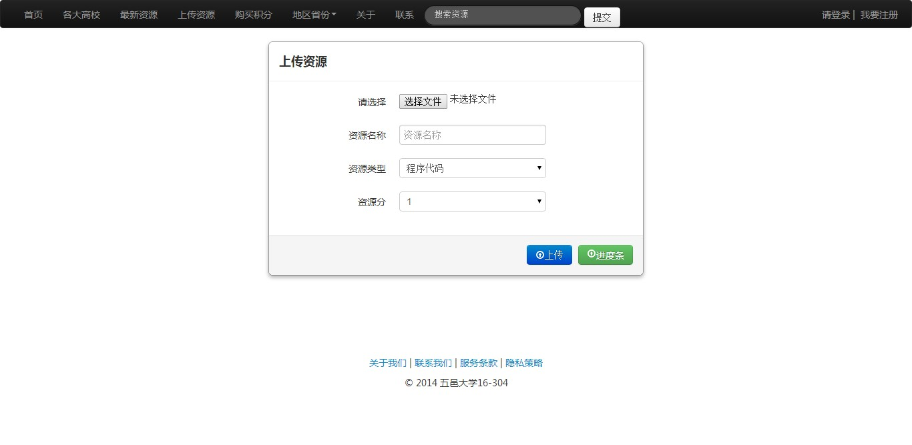
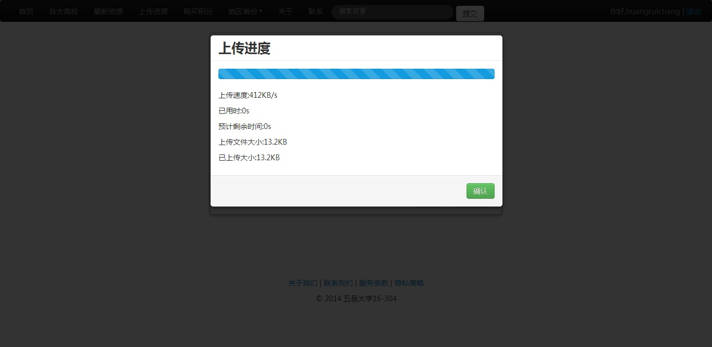
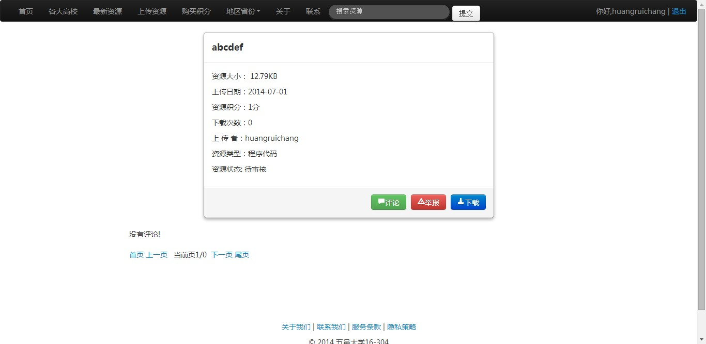
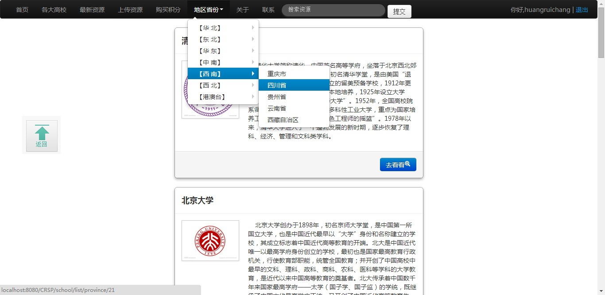
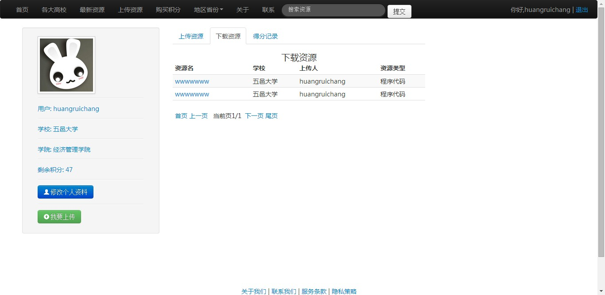

# 高校资源分享平台

> 　　　College Resource Sharing Platform (CRSP)

## Screenshots

## See for more:

- `CRSP`: [CRSP](https://github.com/CRSP/CRSP)

## 亮点
	<ol>
		<li>基于Spring和Hibernate开发，代码清晰易于维护</li>
		<li>使用SpringMVC搭建RESTful接口</li>
		<li>测试驱动开发</li>
		<li>大量使用注释，代码清晰简洁</li>
	</ol>
	
## 优化
	仿照流行云盘，实现秒传功能。
	原理:
		使用sha1对一个文件加密得出的串是唯一的
		同一sha1码的资源只存放一份
		前台使用html5操作文件对资源加密，得出sha1码发送到后台进行验证
		如果已存在资源，则无须上传，实现'秒传'