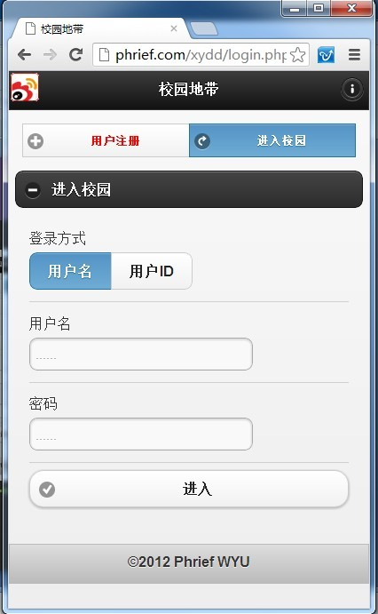
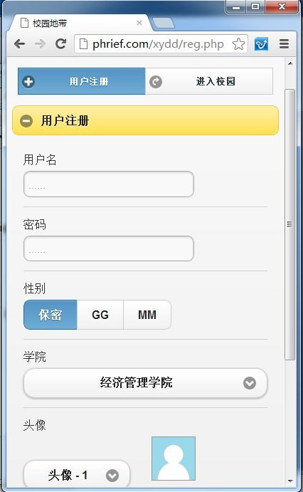
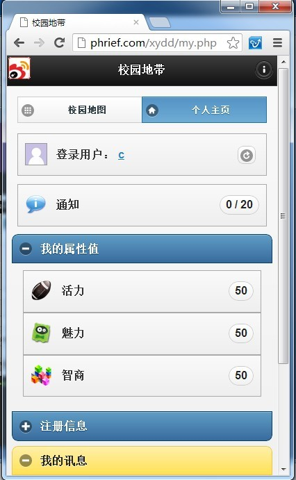
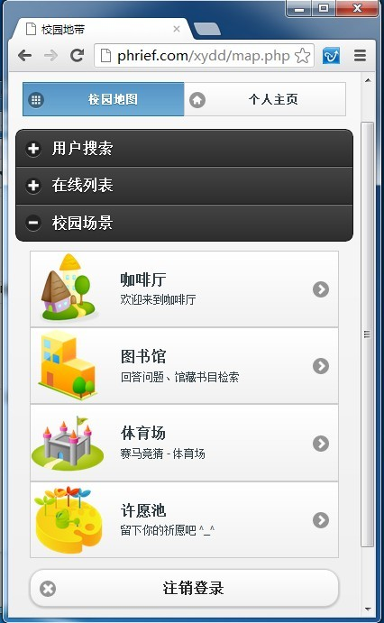
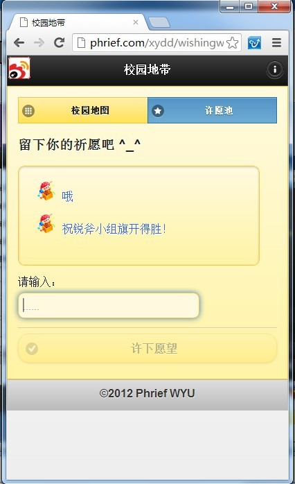

# 校园地带

> 　　　时下活跃在年轻人之间，诸如安卓、苹果等智能手机成为了学生们的新宠。在闲暇的时候用手机上上网是件非常惬意的事情。在这一大潮流之下，各种手机网站应运而生，校园地带也是其中之一。
　　　
>	校园地带是以学生为服务对象的手机网站软件，为学生提供一个信息交流的平台。学生用户可以通过校园地带里面各种休闲娱乐的模块广交结友，通过聊天室进行信息交流、思想碰撞、，可以共同提高学生用户的信息量，知识面，带动网络文化、社区文化的传播，从而提高学生的生活质量。

## Screenshots

&nbsp;&nbsp;&nbsp;&nbsp;

&nbsp;&nbsp;&nbsp;&nbsp;

&nbsp;&nbsp;&nbsp;&nbsp;

&nbsp;&nbsp;&nbsp;&nbsp;

## See for more:

- `xydd`: [xydd](https://github.com/phrief/xydd)

## 感言

	这是在大学里和挚友亮爷一起完成的第一个比较完整的作品，感谢亮爷带我走上web开发的道路